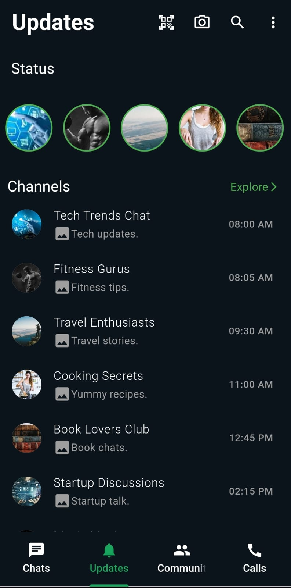

# Whatsapp UI clone

I have created a clone of the Whatsapp UI using Flutter .This is one of my starting project in the journey of learning flutter.It replicates the primary user interface elements and layout of the WhatsApp messaging app.

## Features - 
**Chat List**: Displays a list of recent chats with individual users and groups. 
**Status Screen**: Shows a list of status updates from contacts. 
**Call Screen**: Displays recent call logs with details. 
**Community screen**:Displays different communities .
**Settings**: Provides various options such as account settings, notifications, etc.
**New group**:Screen that provides contacts to make a new group
## Screenshots
Here are a few screenshots of my app:

